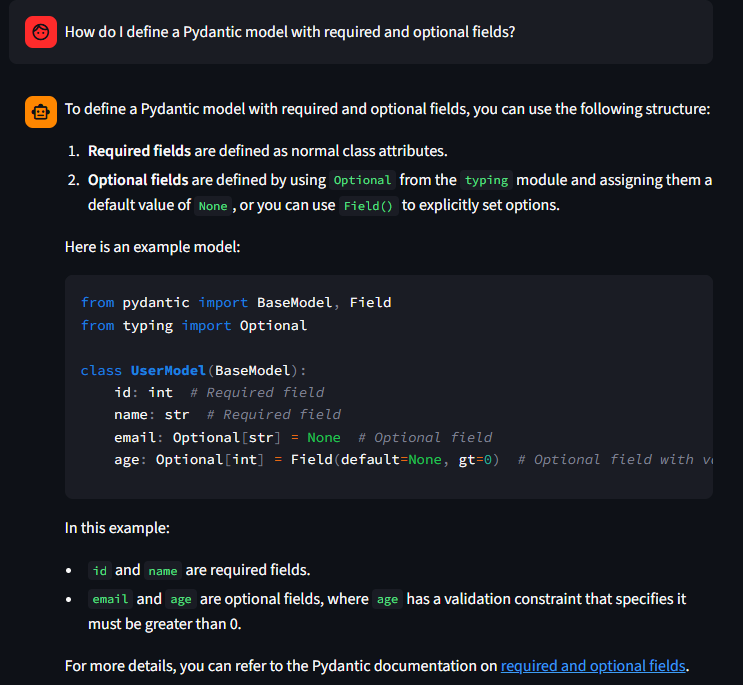
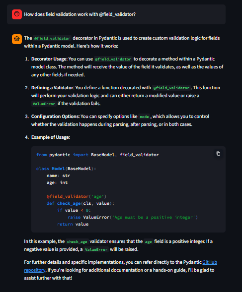
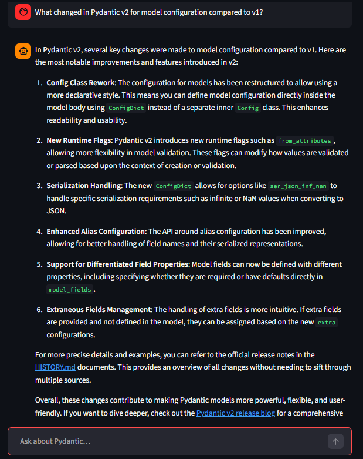

# AskPydantic

An AI-powered assistant that lets you chat with the [Pydantic](https://github.com/pydantic/pydantic) GitHub repository, search its code and docs, and get context-aware answers from indexed documentation chunks.

## Demo

**Pydantic documentation agent** — Streamlit UI. The index is built from **`pydantic/pydantic`** with chunked markdown (**max 400 chunks**; see `project/app`).

Save your screenshots in **`assets/`** using the filenames below, or change the paths to match your files.

### 1. Required and optional fields

**Question:** *How do I define a Pydantic model with required and optional fields?*



The agent explains `BaseModel`, `Optional`, and `Field` with a short code example.

---

### 2. Field validators

**Question:** *How does field validation work with `@field_validator`?*



The agent describes the decorator, validation flow, and a minimal example.

---

### 3. Pydantic v2 model configuration

**Question:** *What changed in Pydantic v2 for model configuration compared to v1?*



The agent summarizes `ConfigDict`, runtime flags, and related v2 changes.

---

## Repository layout

- **`project/`** — homework notebooks (ingest, search, agents, evaluation) and **`project/app/`** — modular **Streamlit** + **CLI** app ([minsearch](https://github.com/alexeygrigorev/minsearch) + [Pydantic AI](https://ai.pydantic.dev/)).
- **`course/`** — parallel course notebooks and **`course/app/`** — FAQ demo for [DataTalksClub/faq](https://github.com/DataTalksClub/faq).
- **`project/eval/`** / **`course/eval/`** — optional evaluation notebooks.

## Quick start (Pydantic app)

```bash
cd project/app
uv sync
# Set OPENAI_API_KEY (e.g. copy .env.example to repo root as .env)
uv run streamlit run app.py
```

```bash
uv run python main.py   # CLI
```

See **`project/Day_06_homework.ipynb`** and **`project/app/README.md`** for deployment. For README polish, see **`project/Day_07_homework.ipynb`**.

## Requirements

- Python 3.12+
- [uv](https://docs.astral.sh/uv/) (recommended) or pip
- `OPENAI_API_KEY` for the LLM (never commit real keys; use `.env` locally and Streamlit/GitHub secrets in production)

## License

Course materials follow your course terms; application code is provided as-is for learning.
